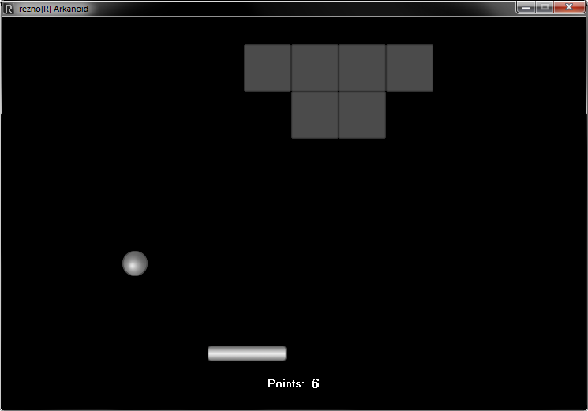
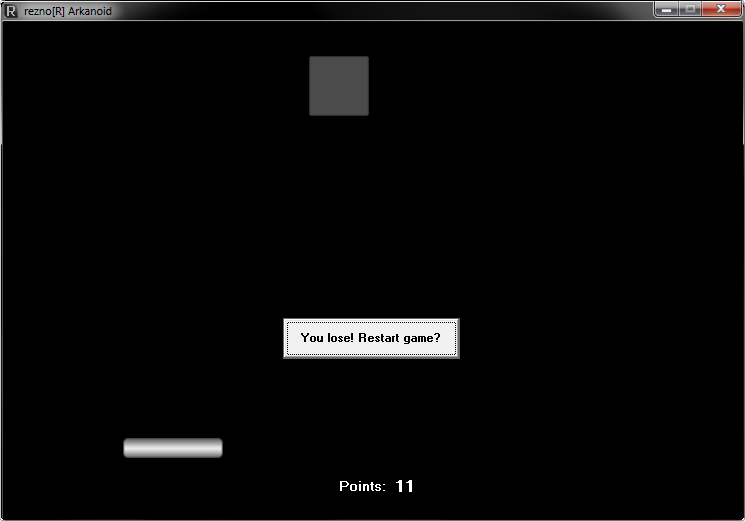

# Learning Object C++ - Windows Builder Arkanoid Game
> Training course - Pasja Informatyki, Object C++ course, episode 10 ( [Link](https://www.youtube.com/watch?v=I_vW4KQ99Yk) )

## General info
Windows GUI game written in C++ Builder 6.0. It's a simple Arkanoid game based on a timer, bitmaps. It counts the total points and allows restarting. The pad has Keyboard controls. Custom icon.

## Technologies
* C++
* C++ Builder 6.0 (IDE)

## Screenshots

## Contact
[ReznoRMichael](https://github.com/ReznoRMichael)